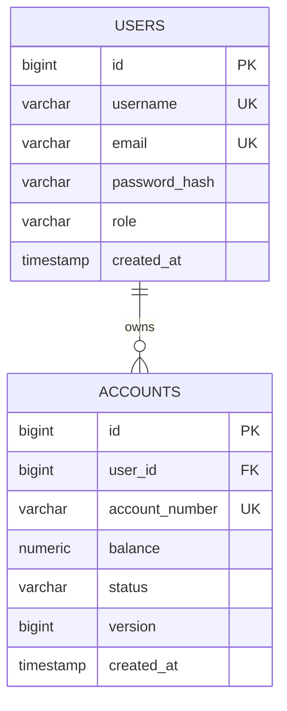

# Phase 1 — Core Banking & Auth (Week 1–4)

> Nguồn: `tools/task-tracker/TaskTracker.gs` (P1). 20 task, ~2h/task.
> Stack: Spring Boot 3.x, Spring Data JPA, PostgreSQL, Flyway, Spring Security 6, JJWT, Testcontainers, BCrypt, Lombok.

## Mục tiêu phase

Dựng nền móng: user/account CRUD, auth (JWT + role-based), và double-entry ledger cho deposit/withdraw/transfer với concurrency an toàn. Mọi phase sau đều phụ thuộc vào `User`, `Account`, `Transaction`/`LedgerEntry` thiết kế ở đây — làm đúng ngay từ đầu quan trọng hơn làm nhanh.

## Cấu trúc package đề xuất

```
com.minibank
├── common/          # BaseEntity, ApiError, GlobalExceptionHandler
├── user/            # User entity, Role enum, UserRepository
├── auth/            # JwtUtil, JwtAuthFilter, SecurityConfig, AuthController
├── account/         # Account entity, AccountStatus, AccountService, AccountController
└── transaction/     # Transaction, LedgerEntry, TransactionService, TransactionController
```

## Definition of Done

- `docker compose up` chạy Postgres, app start OK, `/actuator/health` = `UP`.
- Đăng ký/đăng nhập trả JWT hợp lệ, phân quyền CUSTOMER/TELLER/ADMIN hoạt động.
- Deposit/withdraw/transfer không mất tiền khi chạy song song (test concurrency pass).
- Test repository chạy trên Postgres thật qua Testcontainers.

---

## Week 1 — Setup & Data Model

### 1. Kiểm tra môi trường local (High)

**Công nghệ:** Docker Compose để chạy Postgres local giống production, Spring Boot Actuator để expose health check.

**Tư duy xử lý:** App không nên tự "che" lỗi kết nối DB bằng retry ẩn — nếu Postgres chưa sẵn sàng, app fail-fast là hành vi đúng, dev biết ngay để `docker compose up` trước.

```yaml
# docker-compose.yml
services:
  postgres:
    image: postgres:16-alpine
    environment:
      POSTGRES_DB: minibank
      POSTGRES_USER: minibank
      POSTGRES_PASSWORD: ${DB_PASSWORD:-minibank}
    ports:
      - "5432:5432"
    volumes:
      - pgdata:/var/lib/postgresql/data
    healthcheck:
      test: ["CMD-SHELL", "pg_isready -U minibank"]
      interval: 5s
      timeout: 3s
      retries: 5
volumes:
  pgdata:
```

```properties
# application.properties
spring.datasource.url=jdbc:postgresql://localhost:5432/minibank
spring.datasource.username=${DB_USER:minibank}
spring.datasource.password=${DB_PASSWORD:minibank}
spring.jpa.hibernate.ddl-auto=validate
spring.flyway.enabled=true
management.endpoints.web.exposure.include=health,info
```

Check: `docker compose up -d` → `curl http://localhost:8080/actuator/health` → `{"status":"UP"}`.

---

### 2. Thiết kế ERD User & Account (High)

**Tư duy xử lý:** `User` không lưu số dư — số dư luôn thuộc `Account` (1 user có thể có nhiều account: checking, savings...). `account_number` là mã public sinh riêng, không dùng `id` (tránh lộ thứ tự tạo/số lượng account trong hệ thống).



---

### 3. Viết Flyway migration V1 (High)

**Công nghệ:** Flyway — versioned migration, mỗi thay đổi schema là 1 file SQL immutable (`V1__`, `V2__`...), chạy tự động khi app start.

**Tư duy xử lý:** `balance` phải là `NUMERIC(19,4)` — dùng `double`/`float` sẽ có sai số nhị phân, phá vỡ bất biến double-entry ledger ở Week 4. Unique constraint đặt ở DB, không chỉ validate ở app (chống race condition khi 2 request đăng ký cùng username cùng lúc).

```sql
-- src/main/resources/db/migration/V1__init_users_accounts.sql
CREATE TABLE users (
    id BIGSERIAL PRIMARY KEY,
    username VARCHAR(50) NOT NULL UNIQUE,
    email VARCHAR(255) NOT NULL UNIQUE,
    password_hash VARCHAR(255) NOT NULL,
    role VARCHAR(20) NOT NULL DEFAULT 'CUSTOMER',
    created_at TIMESTAMP NOT NULL DEFAULT now()
);

CREATE TABLE accounts (
    id BIGSERIAL PRIMARY KEY,
    user_id BIGINT NOT NULL REFERENCES users(id),
    account_number VARCHAR(20) NOT NULL UNIQUE,
    balance NUMERIC(19,4) NOT NULL DEFAULT 0,
    status VARCHAR(20) NOT NULL DEFAULT 'ACTIVE',
    version BIGINT NOT NULL DEFAULT 0,
    created_at TIMESTAMP NOT NULL DEFAULT now()
);

CREATE INDEX idx_accounts_user_id ON accounts(user_id);
```

---

### 4. Tạo JPA entity User & Account (High)

**Công nghệ:** `@Version` (JPA optimistic locking) — mỗi lần update, Hibernate tự check `version` chưa đổi mới cho ghi, nếu đổi thì ném `OptimisticLockException`. Đây là cơ chế chống lost-update khi nhiều transaction sửa cùng 1 account.

**Tư duy xử lý:** Thêm `@Version` ngay từ bây giờ dù task deposit/withdraw ở Week 4 mới dùng đến — nếu thêm sau sẽ cần thêm 1 migration riêng và dễ quên.

```java
// user/Role.java
public enum Role { CUSTOMER, TELLER, ADMIN }

// user/User.java
@Entity
@Table(name = "users")
@Getter @Setter
public class User {
    @Id @GeneratedValue(strategy = GenerationType.IDENTITY)
    private Long id;

    @Column(nullable = false, unique = true)
    private String username;

    @Column(nullable = false, unique = true)
    private String email;

    @Column(name = "password_hash", nullable = false)
    private String passwordHash;

    @Enumerated(EnumType.STRING) // KHÔNG dùng ORDINAL — đổi thứ tự enum sẽ sai dữ liệu cũ
    @Column(nullable = false)
    private Role role = Role.CUSTOMER;

    @CreationTimestamp
    private Instant createdAt;
}

// account/AccountStatus.java
public enum AccountStatus { ACTIVE, FROZEN, CLOSED }

// account/Account.java
@Entity
@Table(name = "accounts")
@Getter @Setter
public class Account {
    @Id @GeneratedValue(strategy = GenerationType.IDENTITY)
    private Long id;

    @ManyToOne(fetch = FetchType.LAZY)
    @JoinColumn(name = "user_id", nullable = false)
    private User user;

    @Column(name = "account_number", nullable = false, unique = true)
    private String accountNumber;

    @Column(nullable = false, precision = 19, scale = 4)
    private BigDecimal balance = BigDecimal.ZERO;

    @Enumerated(EnumType.STRING)
    private AccountStatus status = AccountStatus.ACTIVE;

    @Version
    private Long version;

    @CreationTimestamp
    private Instant createdAt;
}
```

```java
// user/UserRepository.java
public interface UserRepository extends JpaRepository<User, Long> {
    Optional<User> findByUsername(String username);
    boolean existsByUsernameOrEmail(String username, String email);
}

// account/AccountRepository.java
public interface AccountRepository extends JpaRepository<Account, Long> {
    Optional<Account> findByAccountNumber(String accountNumber);
    List<Account> findByUserId(Long userId);
}
```

---

### 5. Test repository với Testcontainers (Medium)

**Công nghệ:** Testcontainers — spin lên Postgres thật trong Docker cho test, thay vì H2 in-memory. H2 không bắt được lỗi kiểu dữ liệu/constraint đặc thù Postgres (NUMERIC precision, unique violation behavior khác nhau giữa các DB).

```java
@SpringBootTest
@Testcontainers
class AccountRepositoryTest {

    @Container
    static PostgreSQLContainer<?> postgres = new PostgreSQLContainer<>("postgres:16-alpine");

    @DynamicPropertySource
    static void props(DynamicPropertyRegistry registry) {
        registry.add("spring.datasource.url", postgres::getJdbcUrl);
        registry.add("spring.datasource.username", postgres::getUsername);
        registry.add("spring.datasource.password", postgres::getPassword);
    }

    @Autowired UserRepository userRepository;
    @Autowired AccountRepository accountRepository;

    @Test
    void savesAndFindsByAccountNumber() {
        User user = new User();
        user.setUsername("alice");
        user.setEmail("alice@test.com");
        user.setPasswordHash("hashed");
        userRepository.save(user);

        Account account = new Account();
        account.setUser(user);
        account.setAccountNumber("ACC0001");
        accountRepository.save(account);

        assertThat(accountRepository.findByAccountNumber("ACC0001")).isPresent();
    }

    @Test
    void duplicateUsernameViolatesConstraint() {
        User u1 = newUser("bob", "bob@test.com");
        userRepository.saveAndFlush(u1);
        User u2 = newUser("bob", "other@test.com");
        assertThrows(DataIntegrityViolationException.class,
            () -> userRepository.saveAndFlush(u2));
    }
}
```

---

## Week 2 — Auth & Security

### 6. API đăng ký tài khoản (High)

**Công nghệ:** BCrypt — hash password 1 chiều với salt tự động, chống rainbow table. DTO riêng cho input — không bind entity trực tiếp (chống mass assignment: client không thể tự set `role=ADMIN` qua JSON).

**Tư duy xử lý:** Check trùng email/username ở service **trước** khi insert (trả lỗi 409 rõ ràng, UX tốt hơn), nhưng unique constraint DB (task 3) vẫn là lớp bảo vệ cuối cùng chống race condition (2 request đăng ký cùng username y hệt trong cùng millisecond).

```java
// auth/dto/RegisterRequest.java
public record RegisterRequest(
    @NotBlank @Size(min = 3, max = 50) String username,
    @NotBlank @Email String email,
    @NotBlank @Size(min = 8) String password
) {}

// common/config/SecurityBeansConfig.java
@Configuration
public class SecurityBeansConfig {
    @Bean
    public PasswordEncoder passwordEncoder() {
        return new BCryptPasswordEncoder();
    }
}

// auth/AuthService.java
@Service
@RequiredArgsConstructor
public class AuthService {
    private final UserRepository userRepository;
    private final PasswordEncoder passwordEncoder;

    @Transactional
    public User register(RegisterRequest req) {
        if (userRepository.existsByUsernameOrEmail(req.username(), req.email())) {
            throw new ConflictException("Username or email already taken");
        }
        User user = new User();
        user.setUsername(req.username());
        user.setEmail(req.email());
        user.setPasswordHash(passwordEncoder.encode(req.password())); // never log raw password
        user.setRole(Role.CUSTOMER);
        return userRepository.save(user);
    }
}

// auth/AuthController.java
@RestController
@RequestMapping("/api/auth")
@RequiredArgsConstructor
public class AuthController {
    private final AuthService authService;

    @PostMapping("/register")
    public ResponseEntity<Void> register(@Valid @RequestBody RegisterRequest req) {
        authService.register(req);
        return ResponseEntity.status(HttpStatus.CREATED).build();
    }
}
```

---

### 7. Cấu hình Spring Security cơ bản (High)

**Công nghệ:** `SecurityFilterChain` (Spring Security 6, thay cho `WebSecurityConfigurerAdapter` đã deprecated). `SessionCreationPolicy.STATELESS` — không tạo `HttpSession`, mọi request tự chứa JWT.

**Tư duy xử lý:** CSRF tồn tại để chống tấn công lợi dụng session cookie tự động gửi kèm request. Vì API này stateless (không dùng cookie session), CSRF disable là an toàn — nhưng phải ghi rõ lý do để không bị hiểu nhầm là "quên bật".

```java
// auth/SecurityConfig.java
@Configuration
@EnableWebSecurity
@EnableMethodSecurity // bật @PreAuthorize
@RequiredArgsConstructor
public class SecurityConfig {
    private final JwtAuthFilter jwtAuthFilter;

    @Bean
    public SecurityFilterChain filterChain(HttpSecurity http) throws Exception {
        return http
            // Stateless JWT API — không có cookie session nên CSRF disable an toàn
            .csrf(csrf -> csrf.disable())
            .sessionManagement(sm -> sm.sessionCreationPolicy(SessionCreationPolicy.STATELESS))
            .authorizeHttpRequests(auth -> auth
                .requestMatchers("/api/auth/**", "/actuator/health").permitAll()
                .anyRequest().authenticated())
            .addFilterBefore(jwtAuthFilter, UsernamePasswordAuthenticationFilter.class)
            .build();
    }
}
```

---

### 8. Xây dựng JWT util và API đăng nhập (High)

**Công nghệ:** JJWT (`io.jsonwebtoken`) — thư viện chuẩn để sign/verify JWT bằng HMAC-SHA256. Secret đọc từ env var, **không hardcode**.

**Tư duy xử lý:** Token TTL ngắn (15-30 phút) giới hạn thiệt hại nếu token bị lộ. Login trả token, không trả password hash hay thông tin nhạy cảm khác.

```java
// auth/JwtUtil.java
@Component
public class JwtUtil {
    private final SecretKey key;
    private final long expirationMs;

    public JwtUtil(@Value("${jwt.secret}") String secret,
                    @Value("${jwt.expiration-ms:1800000}") long expirationMs) {
        this.key = Keys.hmacShaKeyFor(secret.getBytes(StandardCharsets.UTF_8));
        this.expirationMs = expirationMs;
    }

    public String generateToken(String username, Role role) {
        Instant now = Instant.now();
        return Jwts.builder()
            .subject(username)
            .claim("role", role.name())
            .issuedAt(Date.from(now))
            .expiration(Date.from(now.plusMillis(expirationMs)))
            .signWith(key)
            .compact();
    }

    public Claims parse(String token) {
        return Jwts.parser().verifyWith(key).build()
            .parseSignedClaims(token).getPayload();
    }
}
```

```properties
# application.properties — secret từ env, KHÔNG commit giá trị thật
jwt.secret=${JWT_SECRET}
jwt.expiration-ms=1800000
```

```java
// auth/dto/LoginRequest.java, LoginResponse.java
public record LoginRequest(@NotBlank String username, @NotBlank String password) {}
public record LoginResponse(String accessToken, long expiresIn) {}

// AuthService — thêm method login
public LoginResponse login(LoginRequest req) {
    User user = userRepository.findByUsername(req.username())
        .orElseThrow(() -> new UnauthorizedException("Invalid credentials"));
    if (!passwordEncoder.matches(req.password(), user.getPasswordHash())) {
        throw new UnauthorizedException("Invalid credentials");
    }
    String token = jwtUtil.generateToken(user.getUsername(), user.getRole());
    return new LoginResponse(token, 1800);
}

// AuthController — thêm endpoint
@PostMapping("/login")
public LoginResponse login(@Valid @RequestBody LoginRequest req) {
    return authService.login(req);
}
```

---

### 9. JWT authentication filter (High)

**Công nghệ:** `OncePerRequestFilter` — filter Spring Security chạy 1 lần/request, đọc header `Authorization`, validate token, gán `Authentication` vào `SecurityContextHolder` để các bước sau (kể cả `@PreAuthorize`) nhận diện được user.

**Tư duy xử lý:** Phân biệt rõ token hết hạn (`ExpiredJwtException`) vs token sai chữ ký (`SignatureException`) để trả lỗi 401 có message rõ ràng, thay vì để exception văng ra ngoài thành lỗi 500.

```java
// auth/JwtAuthFilter.java
@Component
@RequiredArgsConstructor
public class JwtAuthFilter extends OncePerRequestFilter {
    private final JwtUtil jwtUtil;

    @Override
    protected void doFilterInternal(HttpServletRequest request, HttpServletResponse response,
                                     FilterChain chain) throws ServletException, IOException {
        String header = request.getHeader("Authorization");
        if (header != null && header.startsWith("Bearer ")) {
            try {
                Claims claims = jwtUtil.parse(header.substring(7));
                String username = claims.getSubject();
                String role = claims.get("role", String.class);
                var authorities = List.of(new SimpleGrantedAuthority("ROLE_" + role));
                var auth = new UsernamePasswordAuthenticationToken(username, null, authorities);
                SecurityContextHolder.getContext().setAuthentication(auth);
            } catch (ExpiredJwtException | SignatureException | MalformedJwtException e) {
                response.setStatus(HttpServletResponse.SC_UNAUTHORIZED);
                response.getWriter().write("{\"error\":\"Invalid or expired token\"}");
                return;
            }
        }
        chain.doFilter(request, response);
    }
}
```

---

### 10. Phân quyền theo role (High)

**Công nghệ:** `@EnableMethodSecurity` + `@PreAuthorize` — authorize ở tầng method, biểu thức SpEL đọc `GrantedAuthority` gán ở filter (task 9). Spring Security quy ước prefix `ROLE_` cho `hasRole()`.

```java
// Ví dụ áp dụng trên endpoint đổi trạng thái account (đầy đủ ở task 13)
@PreAuthorize("hasAnyRole('ADMIN', 'TELLER')")
@PatchMapping("/api/accounts/{id}/status")
public AccountResponse changeStatus(@PathVariable Long id, @RequestBody StatusRequest req) {
    ...
}

// Helper lấy user hiện tại từ SecurityContext (dùng lại nhiều nơi)
public final class CurrentUser {
    public static String username() {
        return SecurityContextHolder.getContext().getAuthentication().getName();
    }
}
```

---

## Week 3 — Account Module

### 11. API mở tài khoản (High)

**Tư duy xử lý:** `userId` **không** được nhận từ request body — lấy từ `SecurityContext` (task 10), tránh IDOR (user A mở account gán cho user B). `account_number` sinh bằng prefix + random, retry nếu đụng unique constraint thay vì lock cả bảng.

```java
// account/AccountService.java
@Service
@RequiredArgsConstructor
public class AccountService {
    private final AccountRepository accountRepository;
    private final UserRepository userRepository;

    @Transactional
    public Account openAccount(String username) {
        User user = userRepository.findByUsername(username)
            .orElseThrow(() -> new NotFoundException("User not found"));

        Account account = new Account();
        account.setUser(user);
        account.setAccountNumber(generateUniqueAccountNumber());
        return accountRepository.save(account);
    }

    private String generateUniqueAccountNumber() {
        for (int i = 0; i < 5; i++) {
            String candidate = "ACC" + String.format("%09d", new SecureRandom().nextInt(1_000_000_000));
            if (accountRepository.findByAccountNumber(candidate).isEmpty()) return candidate;
        }
        throw new IllegalStateException("Could not generate unique account number");
    }
}

// account/AccountController.java
@RestController
@RequestMapping("/api/accounts")
@RequiredArgsConstructor
public class AccountController {
    private final AccountService accountService;

    @PostMapping
    public ResponseEntity<AccountResponse> open() {
        Account account = accountService.openAccount(CurrentUser.username());
        return ResponseEntity.status(HttpStatus.CREATED).body(AccountResponse.from(account));
    }
}
```

---

### 12. API xem danh sách/chi tiết tài khoản (Medium)

**Tư duy xử lý:** Luôn check ownership trước khi trả data (trừ ADMIN/TELLER). Trả DTO riêng — không serialize entity trực tiếp (tránh leak field như `user.passwordHash` qua quan hệ lazy).

```java
public record AccountResponse(Long id, String accountNumber, BigDecimal balance, String status) {
    static AccountResponse from(Account a) {
        return new AccountResponse(a.getId(), a.getAccountNumber(), a.getBalance(), a.getStatus().name());
    }
}

// AccountService
public Account getOwnedAccount(Long accountId, String username) {
    Account account = accountRepository.findById(accountId)
        .orElseThrow(() -> new NotFoundException("Account not found"));
    if (!account.getUser().getUsername().equals(username)) {
        throw new ForbiddenException("Not your account");
    }
    return account;
}

// AccountController
@GetMapping("/{id}")
public AccountResponse detail(@PathVariable Long id) {
    return AccountResponse.from(accountService.getOwnedAccount(id, CurrentUser.username()));
}

@GetMapping
public List<AccountResponse> myAccounts() {
    return accountService.listByUsername(CurrentUser.username())
        .stream().map(AccountResponse::from).toList();
}
```

---

### 13. Trạng thái tài khoản (Medium)

**Tư duy xử lý:** State transition nên đi qua 1 method dùng chung — tránh việc set status tự do rải rác ở nhiều nơi, dễ gây bug (vd set ACTIVE cho account đã CLOSED).

```java
public record StatusRequest(@NotNull AccountStatus status) {}

// AccountService
@Transactional
@PreAuthorize("hasAnyRole('ADMIN', 'TELLER')")
public Account changeStatus(Long accountId, AccountStatus target) {
    Account account = accountRepository.findById(accountId)
        .orElseThrow(() -> new NotFoundException("Account not found"));
    if (account.getStatus() == AccountStatus.CLOSED) {
        throw new BusinessRuleException("Cannot change status of a closed account");
    }
    account.setStatus(target);
    return account; // dirty checking — không cần gọi save() tường minh trong @Transactional
}
```

---

### 14. Global exception handling (High)

**Tư duy xử lý:** Response error format thống nhất — mọi phase sau tái sử dụng nguyên class này thay vì tự viết handler riêng.

```java
// common/exception/ApiError.java
public record ApiError(Instant timestamp, int status, String error, String message, String path) {}

// common/exception/GlobalExceptionHandler.java
@RestControllerAdvice
public class GlobalExceptionHandler {

    @ExceptionHandler(MethodArgumentNotValidException.class)
    public ResponseEntity<ApiError> handleValidation(MethodArgumentNotValidException ex, HttpServletRequest req) {
        String message = ex.getBindingResult().getFieldErrors().stream()
            .map(f -> f.getField() + ": " + f.getDefaultMessage())
            .collect(Collectors.joining(", "));
        return build(HttpStatus.BAD_REQUEST, message, req);
    }

    @ExceptionHandler(NotFoundException.class)
    public ResponseEntity<ApiError> handleNotFound(NotFoundException ex, HttpServletRequest req) {
        return build(HttpStatus.NOT_FOUND, ex.getMessage(), req);
    }

    @ExceptionHandler(ForbiddenException.class)
    public ResponseEntity<ApiError> handleForbidden(ForbiddenException ex, HttpServletRequest req) {
        return build(HttpStatus.FORBIDDEN, ex.getMessage(), req);
    }

    @ExceptionHandler(ConflictException.class)
    public ResponseEntity<ApiError> handleConflict(ConflictException ex, HttpServletRequest req) {
        return build(HttpStatus.CONFLICT, ex.getMessage(), req);
    }

    @ExceptionHandler(BusinessRuleException.class)
    public ResponseEntity<ApiError> handleBusinessRule(BusinessRuleException ex, HttpServletRequest req) {
        return build(HttpStatus.UNPROCESSABLE_ENTITY, ex.getMessage(), req);
    }

    @ExceptionHandler(Exception.class)
    public ResponseEntity<ApiError> handleGeneric(Exception ex, HttpServletRequest req) {
        return build(HttpStatus.INTERNAL_SERVER_ERROR, "Unexpected error", req);
    }

    private ResponseEntity<ApiError> build(HttpStatus status, String message, HttpServletRequest req) {
        ApiError body = new ApiError(Instant.now(), status.value(), status.getReasonPhrase(), message, req.getRequestURI());
        return ResponseEntity.status(status).body(body);
    }
}
```

---

### 15. Unit test cho account service (Medium)

```java
@ExtendWith(MockitoExtension.class)
class AccountServiceTest {
    @Mock AccountRepository accountRepository;
    @Mock UserRepository userRepository;
    @InjectMocks AccountService accountService;

    @Test
    void cannotChangeStatusOfClosedAccount() {
        Account closed = new Account();
        closed.setStatus(AccountStatus.CLOSED);
        when(accountRepository.findById(1L)).thenReturn(Optional.of(closed));

        assertThrows(BusinessRuleException.class,
            () -> accountService.changeStatus(1L, AccountStatus.ACTIVE));
    }

    @Test
    void getOwnedAccountRejectsNonOwner() {
        User owner = new User(); owner.setUsername("alice");
        Account account = new Account(); account.setUser(owner);
        when(accountRepository.findById(1L)).thenReturn(Optional.of(account));

        assertThrows(ForbiddenException.class,
            () -> accountService.getOwnedAccount(1L, "bob"));
    }
}
```

---

## Week 4 — Ledger & Transactions

### 16. Thiết kế double-entry ledger (High)

**Tư duy xử lý:** Bất biến quan trọng nhất hệ thống: mỗi transfer sinh **2** ledger entry (1 DEBIT, 1 CREDIT), tổng theo hướng phù hợp = 0. Không lưu balance "tổng hợp" là nguồn sự thật duy nhất — ledger mới là nguồn sự thật, `accounts.balance` là giá trị denormalize để đọc nhanh.

```sql
-- V2__ledger.sql
CREATE TABLE transactions (
    id BIGSERIAL PRIMARY KEY,
    type VARCHAR(20) NOT NULL,          -- DEPOSIT, WITHDRAW, TRANSFER
    amount NUMERIC(19,4) NOT NULL,
    reference VARCHAR(64) UNIQUE,       -- idempotency key
    created_at TIMESTAMP NOT NULL DEFAULT now()
);

CREATE TABLE ledger_entries (
    id BIGSERIAL PRIMARY KEY,
    transaction_id BIGINT NOT NULL REFERENCES transactions(id),
    account_id BIGINT NOT NULL REFERENCES accounts(id),
    direction VARCHAR(10) NOT NULL,     -- DEBIT, CREDIT
    amount NUMERIC(19,4) NOT NULL,
    created_at TIMESTAMP NOT NULL DEFAULT now()
);

CREATE INDEX idx_ledger_account_id ON ledger_entries(account_id);
```

```java
public enum TransactionType { DEPOSIT, WITHDRAW, TRANSFER }
public enum Direction { DEBIT, CREDIT }

@Entity @Table(name = "transactions") @Getter @Setter
public class Transaction {
    @Id @GeneratedValue(strategy = GenerationType.IDENTITY) private Long id;
    @Enumerated(EnumType.STRING) private TransactionType type;
    @Column(precision = 19, scale = 4) private BigDecimal amount;
    private String reference;
    @CreationTimestamp private Instant createdAt;
}

@Entity @Table(name = "ledger_entries") @Getter @Setter
public class LedgerEntry {
    @Id @GeneratedValue(strategy = GenerationType.IDENTITY) private Long id;
    @ManyToOne @JoinColumn(name = "transaction_id") private Transaction transaction;
    @ManyToOne @JoinColumn(name = "account_id") private Account account;
    @Enumerated(EnumType.STRING) private Direction direction;
    @Column(precision = 19, scale = 4) private BigDecimal amount;
    @CreationTimestamp private Instant createdAt;
}
```

---

### 17. API deposit & withdraw (High)

**Tư duy xử lý:** Withdraw phải check `balance >= amount` **trong cùng transaction** với update — check rồi update riêng là race condition kinh điển (2 withdraw đọc cùng balance trước khi cái nào ghi xong). `@Version` (task 4) bắt được conflict, catch và trả 409.

```java
// transaction/TransactionService.java
@Service
@RequiredArgsConstructor
public class TransactionService {
    private final AccountRepository accountRepository;
    private final TransactionRepository transactionRepository;
    private final LedgerEntryRepository ledgerEntryRepository;

    @Transactional
    public Transaction deposit(Long accountId, BigDecimal amount, String reference) {
        requirePositive(amount);
        Account account = lockedAccount(accountId);
        account.setBalance(account.getBalance().add(amount));

        Transaction tx = saveTransaction(TransactionType.DEPOSIT, amount, reference);
        saveEntry(tx, account, Direction.CREDIT, amount);
        return tx;
    }

    @Transactional
    public Transaction withdraw(Long accountId, BigDecimal amount, String reference) {
        requirePositive(amount);
        Account account = lockedAccount(accountId);
        if (account.getBalance().compareTo(amount) < 0) {
            throw new BusinessRuleException("Insufficient balance");
        }
        account.setBalance(account.getBalance().subtract(amount));

        Transaction tx = saveTransaction(TransactionType.WITHDRAW, amount, reference);
        saveEntry(tx, account, Direction.DEBIT, amount);
        return tx;
    }

    private Account lockedAccount(Long id) {
        // @Version trên Account (task 4) đã đủ cho optimistic locking;
        // update balance + version cùng lúc trong transaction này.
        return accountRepository.findById(id).orElseThrow(() -> new NotFoundException("Account not found"));
    }

    private void requirePositive(BigDecimal amount) {
        if (amount.compareTo(BigDecimal.ZERO) <= 0) throw new BusinessRuleException("Amount must be positive");
    }

    private Transaction saveTransaction(TransactionType type, BigDecimal amount, String reference) {
        Transaction tx = new Transaction();
        tx.setType(type); tx.setAmount(amount); tx.setReference(reference);
        return transactionRepository.save(tx);
    }

    private void saveEntry(Transaction tx, Account account, Direction direction, BigDecimal amount) {
        LedgerEntry entry = new LedgerEntry();
        entry.setTransaction(tx); entry.setAccount(account);
        entry.setDirection(direction); entry.setAmount(amount);
        ledgerEntryRepository.save(entry);
    }
}
```

```java
// controller — trả 409 khi optimistic lock conflict
@ExceptionHandler(ObjectOptimisticLockingFailureException.class)
public ResponseEntity<ApiError> handleOptimisticLock(ObjectOptimisticLockingFailureException ex, HttpServletRequest req) {
    return build(HttpStatus.CONFLICT, "Concurrent update, please retry", req);
}
```

---

### 18. API transfer tiền (High)

**Tư duy xử lý:** Toàn bộ (trừ nguồn + cộng đích + 2 ledger entry) phải nằm trong **1** `@Transactional` — hoặc tất cả thành công, hoặc rollback hết. Idempotency key (`reference`, unique constraint) chống double-submit khi client retry do timeout mạng. Nếu cần lock 2 account, luôn lock theo thứ tự ID tăng dần để tránh deadlock.

```java
@Transactional
public Transaction transfer(Long fromId, Long toId, BigDecimal amount, String reference) {
    requirePositive(amount);
    if (fromId.equals(toId)) throw new BusinessRuleException("Cannot transfer to the same account");

    // Idempotency: nếu reference đã tồn tại, trả lại transaction cũ thay vì transfer lần 2
    Optional<Transaction> existing = transactionRepository.findByReference(reference);
    if (existing.isPresent()) return existing.get();

    // Lock order cố định theo id tăng dần — tránh deadlock khi 2 transfer ngược chiều chạy song song
    Long firstId = Math.min(fromId, toId);
    Long secondId = Math.max(fromId, toId);
    Account first = lockedAccount(firstId);
    Account second = lockedAccount(secondId);
    Account from = firstId.equals(fromId) ? first : second;
    Account to = firstId.equals(toId) ? first : second;

    if (from.getStatus() != AccountStatus.ACTIVE || to.getStatus() != AccountStatus.ACTIVE) {
        throw new BusinessRuleException("Both accounts must be ACTIVE");
    }
    if (from.getBalance().compareTo(amount) < 0) {
        throw new BusinessRuleException("Insufficient balance");
    }

    from.setBalance(from.getBalance().subtract(amount));
    to.setBalance(to.getBalance().add(amount));

    Transaction tx = saveTransaction(TransactionType.TRANSFER, amount, reference);
    saveEntry(tx, from, Direction.DEBIT, amount);
    saveEntry(tx, to, Direction.CREDIT, amount);
    return tx;
}
```

```java
public record TransferRequest(
    @NotNull Long fromAccountId,
    @NotNull Long toAccountId,
    @NotNull @DecimalMin("0.01") BigDecimal amount,
    @NotBlank String reference // client-generated idempotency key, vd UUID
) {}
```

---

### 19. Test concurrency cho transfer (High)

**Tư duy xử lý:** Đây là test quan trọng nhất Phase 1. Bắn N thread transfer đồng thời trên cùng cặp account, sau đó assert tổng 2 bên không đổi — nếu fail, quay lại kiểm tra `@Version` (task 4) và lock order (task 18).

```java
@SpringBootTest
@Testcontainers
class TransferConcurrencyTest {
    @Container static PostgreSQLContainer<?> postgres = new PostgreSQLContainer<>("postgres:16-alpine");
    @DynamicPropertySource static void props(DynamicPropertyRegistry r) {
        r.add("spring.datasource.url", postgres::getJdbcUrl);
        r.add("spring.datasource.username", postgres::getUsername);
        r.add("spring.datasource.password", postgres::getPassword);
    }

    @Autowired TransactionService transactionService;
    @Autowired AccountRepository accountRepository;

    @Test
    void concurrentTransfersPreserveTotalBalance() throws InterruptedException {
        Account a = createAccountWithBalance("A", new BigDecimal("1000.00"));
        Account b = createAccountWithBalance("B", new BigDecimal("1000.00"));
        BigDecimal totalBefore = a.getBalance().add(b.getBalance());

        int threads = 50;
        ExecutorService pool = Executors.newFixedThreadPool(threads);
        CountDownLatch latch = new CountDownLatch(threads);

        for (int i = 0; i < threads; i++) {
            final String ref = UUID.randomUUID().toString();
            pool.submit(() -> {
                try {
                    retryOnConflict(() ->
                        transactionService.transfer(a.getId(), b.getId(), BigDecimal.ONE, ref));
                } finally {
                    latch.countDown();
                }
            });
        }
        latch.await(30, TimeUnit.SECONDS);

        Account aAfter = accountRepository.findById(a.getId()).orElseThrow();
        Account bAfter = accountRepository.findById(b.getId()).orElseThrow();
        BigDecimal totalAfter = aAfter.getBalance().add(bAfter.getBalance());

        assertThat(totalAfter).isEqualByComparingTo(totalBefore); // không mất/sinh thêm tiền
    }

    private void retryOnConflict(Runnable action) {
        for (int attempt = 0; attempt < 5; attempt++) {
            try { action.run(); return; }
            catch (ObjectOptimisticLockingFailureException e) { /* retry */ }
        }
    }
}
```

---

### 20. API lịch sử giao dịch (Medium)

**Tư duy xử lý:** Trả `direction` (in/out) tính theo góc nhìn của account đang query — client không nên tự suy luận từ raw ledger entry.

```java
// LedgerEntryRepository
public interface LedgerEntryRepository extends JpaRepository<LedgerEntry, Long> {
    Page<LedgerEntry> findByAccountIdAndCreatedAtBetween(
        Long accountId, Instant from, Instant to, Pageable pageable);
}

public record TransactionHistoryItem(
    Long transactionId, String type, BigDecimal amount, String direction, Instant createdAt) {}

// AccountController
@GetMapping("/{id}/transactions")
public Page<TransactionHistoryItem> history(
        @PathVariable Long id,
        @RequestParam(required = false) @DateTimeFormat(iso = DATE) LocalDate from,
        @RequestParam(required = false) @DateTimeFormat(iso = DATE) LocalDate to,
        Pageable pageable) {
    accountService.getOwnedAccount(id, CurrentUser.username()); // ownership check trước
    return transactionService.history(id, from, to, pageable);
}
```

---

## Kiến thức hay bị hỏi khi phỏng vấn (từ phase này)

- Vì sao dùng optimistic locking (`@Version`) thay vì pessimistic (`SELECT FOR UPDATE`) cho balance update — tradeoff throughput vs retry, và khi nào nên đổi sang pessimistic (contention rất cao trên cùng 1 account).
- Double-entry ledger là gì, vì sao ngân hàng thật dùng pattern này thay vì chỉ lưu `balance` trên account (audit trail, khả năng dò lại lịch sử, bất biến toán học dùng để phát hiện bug/gian lận).
- Idempotency key giải quyết vấn đề gì (network retry, double-submit) và implement ở tầng nào (unique constraint trên `reference`, check-trước-khi-làm).
- Lock ordering chống deadlock: vì sao luôn lock 2 account theo thứ tự ID cố định.
- JWT stateless vs session — vì sao CSRF disable là an toàn ở đây, khi nào thì KHÔNG an toàn (nếu API dùng cookie để lưu token thay vì header).
