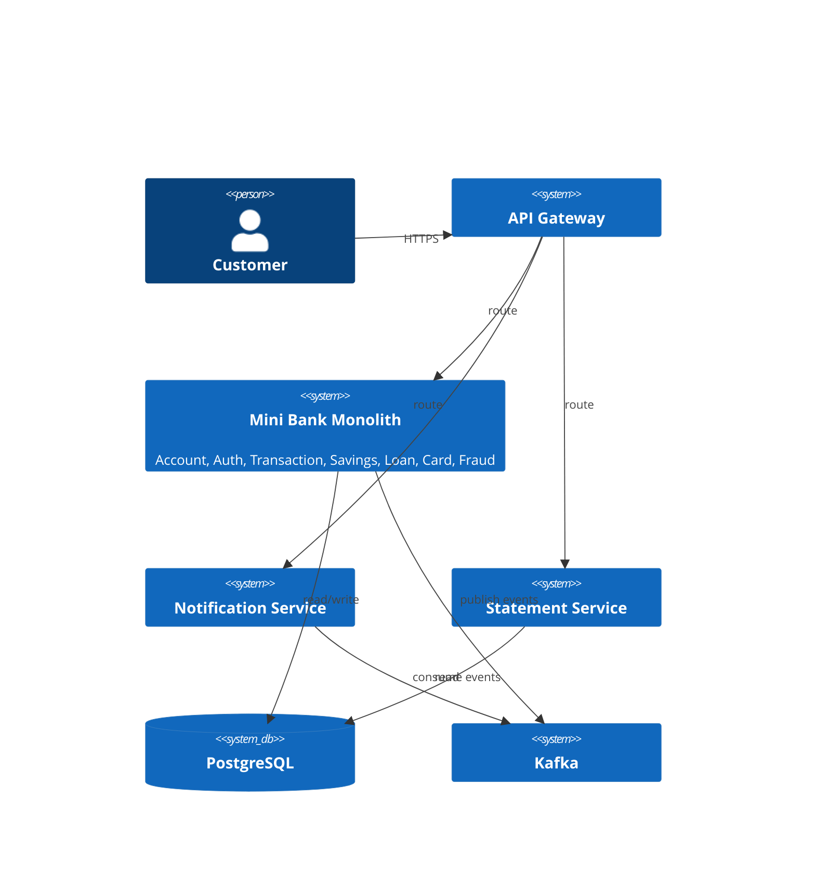

# Phase 6 — Polish, Frontend & Ship (Week 21–24)

> Nguồn: `tools/task-tracker/TaskTracker.gs` (P6). 20 task (bao gồm 5 buffer/catch-up ở Week 24).
> Stack thêm: Next.js 14+ (App Router), TypeScript, GitHub Actions.

## Mục tiêu phase

Chốt chất lượng backend, dựng frontend Next.js tối thiểu để demo toàn bộ luồng, dockerize + CI, chuẩn bị tư liệu CV/phỏng vấn.

## Cấu trúc frontend đề xuất (`mini-bank-fe`)

```
src/
├── app/
│   ├── login/page.tsx
│   ├── register/page.tsx
│   ├── dashboard/page.tsx
│   ├── transfer/page.tsx
│   └── admin/page.tsx
├── lib/
│   ├── apiClient.ts       # fetch wrapper tập trung
│   └── auth.ts            # lưu/đọc JWT
└── components/
```

## Definition of Done

- Coverage unit test ≥80% cho service layer các module chính, OpenAPI/Swagger đầy đủ.
- FE chạy được: đăng nhập, dashboard, chuyển tiền (kèm OTP flow), lịch sử, trang admin tối thiểu.
- `docker-compose` chạy full stack, CI GitHub Actions build+test mỗi push.

---

## Week 21 — Backend Polish

### 1. Tăng coverage unit test (Medium)

**Tư duy xử lý:** Ưu tiên test business logic (rule, tính toán — vd amortization Phase 3, penalty Phase 2, fraud rule Phase 4) hơn getter/setter/mapping đơn thuần. Coverage % không phải mục tiêu tự thân.

```xml
<!-- pom.xml — JaCoCo để đo coverage -->
<plugin>
    <groupId>org.jacoco</groupId>
    <artifactId>jacoco-maven-plugin</artifactId>
    <executions>
        <execution><goals><goal>prepare-agent</goal></goals></execution>
        <execution><id>report</id><phase>test</phase><goals><goal>report</goal></goals></execution>
    </executions>
</plugin>
```

### 2. Hoàn thiện OpenAPI/Swagger (Low)

Rà soát `@Schema(example = ...)` cho mọi DTO — đây là tài liệu FE dùng trực tiếp ở Week 22-23, nên ví dụ phải đúng format thật (vd `amount: "100.0000"` khớp `NUMERIC(19,4)`).

### 3. Vẽ architecture diagram (Medium)



---

## Week 22 — Frontend Bootstrap

### 4. Khởi tạo Next.js app (Medium)

```typescript
// lib/apiClient.ts — mọi page dùng chung, không gọi fetch rải rác
const BASE_URL = process.env.NEXT_PUBLIC_API_URL ?? "http://localhost:8080";

export async function apiFetch<T>(path: string, options: RequestInit = {}): Promise<T> {
  const token = getToken();
  const res = await fetch(`${BASE_URL}${path}`, {
    ...options,
    headers: {
      "Content-Type": "application/json",
      ...(token ? { Authorization: `Bearer ${token}` } : {}),
      ...options.headers,
    },
  });
  if (!res.ok) {
    const error = await res.json().catch(() => ({ message: res.statusText }));
    throw new Error(error.message ?? "Request failed");
  }
  return res.json() as Promise<T>;
}
```

```env
# .env.local
NEXT_PUBLIC_API_URL=http://localhost:8080
```

### 5. Trang đăng nhập/đăng ký (Medium)

**Tư duy xử lý:** `localStorage` chọn vì đơn giản hơn implement `httpOnly` cookie (cần backend set cookie thay vì trả JSON token) — tradeoff: dễ bị đọc bởi XSS nếu có lỗ hổng injection script. Ghi rõ lựa chọn này vào case-study (Week 24) vì đây là điểm hay bị hỏi phỏng vấn.

```typescript
// lib/auth.ts
const TOKEN_KEY = "mini_bank_token";
export function saveToken(token: string) { localStorage.setItem(TOKEN_KEY, token); }
export function getToken(): string | null { return typeof window !== "undefined" ? localStorage.getItem(TOKEN_KEY) : null; }
export function clearToken() { localStorage.removeItem(TOKEN_KEY); }
```

```tsx
// app/login/page.tsx
"use client";
import { useState } from "react";
import { useRouter } from "next/navigation";
import { apiFetch } from "@/lib/apiClient";
import { saveToken } from "@/lib/auth";

export default function LoginPage() {
  const [username, setUsername] = useState("");
  const [password, setPassword] = useState("");
  const [error, setError] = useState<string | null>(null);
  const router = useRouter();

  async function handleSubmit(e: React.FormEvent) {
    e.preventDefault();
    setError(null);
    try {
      const { accessToken } = await apiFetch<{ accessToken: string }>("/api/auth/login", {
        method: "POST",
        body: JSON.stringify({ username, password }),
      });
      saveToken(accessToken);
      router.push("/dashboard");
    } catch (err) {
      setError((err as Error).message);
    }
  }

  return (
    <form onSubmit={handleSubmit}>
      <input value={username} onChange={(e) => setUsername(e.target.value)} placeholder="Username" />
      <input value={password} onChange={(e) => setPassword(e.target.value)} type="password" placeholder="Password" />
      {error && <p role="alert">{error}</p>}
      <button type="submit">Login</button>
    </form>
  );
}
```

---

## Week 23 — Core Frontend Screens

### 6. Trang dashboard (Medium)

```tsx
// app/dashboard/page.tsx
"use client";
import { useEffect, useState } from "react";
import { apiFetch } from "@/lib/apiClient";

type Account = { id: number; accountNumber: string; balance: string; status: string };

export default function DashboardPage() {
  const [accounts, setAccounts] = useState<Account[]>([]);
  const [loading, setLoading] = useState(true);

  useEffect(() => {
    apiFetch<Account[]>("/api/accounts").then(setAccounts).finally(() => setLoading(false));
  }, []);

  if (loading) return <p>Loading...</p>;
  if (accounts.length === 0) return <p>No accounts yet.</p>;

  return (
    <ul>
      {accounts.map((a) => (
        <li key={a.id}>{a.accountNumber} — {a.balance} ({a.status})</li>
      ))}
    </ul>
  );
}
```

### 7. Form chuyển tiền + lịch sử giao dịch (Medium)

**Tư duy xử lý:** Flow 2 bước cho giao dịch cần OTP (Phase 4 task 10) — submit transfer trước, nếu backend yêu cầu OTP thì hiện input OTP, gọi lại API kèm OTP.

```tsx
// app/transfer/page.tsx (rút gọn)
async function submitTransfer(payload: TransferPayload, otp?: string) {
  const query = otp ? `?otp=${otp}` : "";
  return apiFetch("/api/transactions/transfer" + query, {
    method: "POST",
    body: JSON.stringify(payload),
  });
}

// UI logic: gọi requestOtp() nếu amount > threshold (đọc từ config hoặc catch lỗi 401 "OTP required")
// sau đó hiện form nhập OTP, gọi lại submitTransfer(payload, otpValue)
```

```tsx
// Lịch sử giao dịch — bảng có phân trang, khớp API Phase 1 task 20
type Page<T> = { content: T[]; totalPages: number; number: number };

const { content, totalPages } = await apiFetch<Page<TxItem>>(
  `/api/accounts/${accountId}/transactions?page=${page}&size=20`);
```

### 8. Trang admin tối thiểu (Low)

```tsx
// app/admin/page.tsx — duyệt giao dịch nghi ngờ (Phase 4) + duyệt khoản vay (Phase 3)
const flagged = await apiFetch<TxItem[]>("/api/transactions/flagged");
const pendingLoans = await apiFetch<LoanApp[]>("/api/loans/pending");
// mỗi item có nút Approve/Reject gọi POST tương ứng — không cần polish UI sâu
```

---

## Week 24 — Ship

### 9. Dockerize toàn bộ hệ thống (Medium)

```dockerfile
# mini-bank-fe/Dockerfile
FROM node:20-alpine AS build
WORKDIR /app
COPY package*.json ./
RUN npm ci
COPY . .
RUN npm run build

FROM node:20-alpine
WORKDIR /app
COPY --from=build /app/.next ./.next
COPY --from=build /app/public ./public
COPY --from=build /app/package*.json ./
RUN npm ci --omit=dev
CMD ["npm", "start"]
```
Thêm service `mini-bank-fe` vào `docker-compose.yml` (Phase 5 task 13) — `docker compose up` chạy toàn bộ.

### 10. Thiết lập CI (Medium)

```yaml
# .github/workflows/ci.yml
name: CI
on: [push, pull_request]
jobs:
  backend:
    runs-on: ubuntu-latest
    steps:
      - uses: actions/checkout@v4
      - uses: actions/setup-java@v4
        with: { java-version: '21', distribution: 'temurin' }
      - run: cd mini-bank-be && mvn -B test
  frontend:
    runs-on: ubuntu-latest
    steps:
      - uses: actions/checkout@v4
      - uses: actions/setup-node@v4
        with: { node-version: '20' }
      - run: cd mini-bank-fe && npm ci && npm run build
```

### 11. Hoàn thiện UI state (Medium)

Mọi page (Week 22-23) cần 3 state cơ bản: `loading` (skeleton/spinner), `error` (message + retry), `empty` (vd "Chưa có tài khoản nào, mở tài khoản đầu tiên"). Kiểm tra thủ công toàn bộ user journey: đăng ký → đăng nhập → mở account → transfer (kèm OTP) → xem lịch sử → admin duyệt.

### 12. Quay video/chụp ảnh demo (Low)

Tư liệu CV — không phải task kỹ thuật, bỏ qua nếu ưu tiên thời gian cho task High/Medium.

### 13. Viết case-study cho README (Medium)

Tổng hợp tradeoff đã rải rác trong 6 file guideline: double-entry ledger (Phase 1), optimistic locking (Phase 1/4), event-driven notification (Phase 3), service extraction boundary (Phase 5), JWT localStorage vs httpOnly cookie (Phase 6).

### 14. Regression cuối cùng (High)

```bash
cd mini-bank-be && mvn test
cd mini-bank-fe && npm run build
docker compose up --build   # full stack smoke test
```
Không skip test nào dù "chắc chắn pass".

### 15-19. Buffer/catch-up 1-5 (Low)

Dự phòng thời gian trễ lịch.

### 20. Tổng kết và chuẩn bị phỏng vấn (Medium)

Tổng hợp mục "Kiến thức hay bị hỏi khi phỏng vấn" ở cuối mỗi file `phase-{1..5}-*.md` thành 1 danh sách Q&A tổng — đây chính là nội dung cốt lõi của `GUIDELINE.md` sẽ viết sau khi build xong (xem ghi chú dưới).

---

## Ghi chú tổng hợp

Sau phase này, 6 file guideline trong `plans/mini-bank-full-build/guidelines/` đã hoàn thành vai trò "tài liệu trước khi build". Theo quyết định trước đó của dự án, sau khi code xong nên tổng hợp thêm 1 `GUIDELINE.md` ở root — ghi lại **những gì đã thực sự được build** (không phải kế hoạch), kèm design decisions thực tế đã chọn và Q&A phỏng vấn — dùng làm tài liệu học lại.
